# Mermaid Diagrams - Biblio System

All Mermaid diagrams used in the LaTeX report. You can render these into PNG/SVG using tools like:
- [Mermaid Live Editor](https://mermaid.live)
- [Mermaid CLI](https://github.com/mermaid-js/mermaid-cli)
- Online converters

---

## 1. Use Case Diagram - Main System

```mermaid
graph TB
    subgraph Acteurs
        U["👤 Utilisateur"]
        A["👨‍💼 Administrateur"]
        V["👁️ Visiteur"]
    end
    
    subgraph "Gestion des Livres"
        UC1["📚 Consulter le catalogue"]
        UC2["🔍 Rechercher un livre"]
        UC3["📖 Voir les détails"]
        UC4["✏️ Gérer les livres - CRUD"]
    end
    
    subgraph "Système de Prêt"
        UC5["📤 Demander un emprunt"]
        UC6["📅 Voir calendrier"]
        UC7["✅ Approuver/Refuser"]
        UC8["🔄 Retourner un livre"]
        UC9["📊 Historique prêts"]
    end
    
    subgraph "Système de Réservation"
        UC10["📑 Réserver un livre"]
        UC11["🎫 Voir position file"]
        UC12["🛠️ Gérer réservations"]
        UC13["📢 Notifier utilisateur"]
    end
    
    subgraph "E-Commerce"
        UC14["🛒 Ajouter au panier"]
        UC15["💳 Passer commande"]
        UC16["💰 Payer Stripe"]
        UC17["📦 Suivre commande"]
        UC18["🎛️ Gérer commandes"]
    end
    
    subgraph "Lecture et Avis"
        UC19["📊 Progression lecture"]
        UC20["🎯 Objectifs lecture"]
        UC21["⭐ Rédiger avis"]
    end
    
    V --> UC1
    V --> UC2
    V --> UC3
    
    U --> UC5
    U --> UC6
    U --> UC8
    U --> UC9
    U --> UC10
    U --> UC11
    U --> UC14
    U --> UC15
    U --> UC16
    U --> UC17
    U --> UC19
    U --> UC20
    U --> UC21
    
    A --> UC4
    A --> UC7
    A --> UC12
    A --> UC13
    A --> UC18
```

---

## 2. Loan Process Sequence Diagram

```mermaid
sequenceDiagram
    participant U as 👤 Utilisateur
    participant S as 🖥️ Système
    participant DB as 💾 Base données
    participant A as 👨‍💼 Admin
    participant E as 📧 Email Service
    
    U->>S: Demander un emprunt
    S->>DB: Vérifier stockEmprunt > 0
    
    alt Stock disponible
        DB-->>S: Stock OK
        S->>DB: Créer Loan (requested)
        DB-->>S: Loan créé
        S->>E: Notifier l'admin
        S-->>U: ✅ Demande enregistrée
        
        A->>S: Consulter demandes
        S-->>A: Liste demandes
        A->>S: Approuver prêt
        S->>DB: Mettre à jour: approved
        S->>DB: Décrémenter stockEmprunt
        S->>DB: Calculer dueDate (+14j)
        S->>E: Notifier utilisateur
        S-->>A: ✅ Prêt approuvé
        
        Note over U,S: Période prêt (14 jours)
        
        U->>S: Retourner livre
        S->>DB: Mettre à jour: returned
        S->>DB: Incrémenter stockEmprunt
        S-->>U: ✅ Retour confirmé
    else Stock indisponible
        DB-->>S: Stock = 0
        S-->>U: Proposer réservation
        U->>S: Confirmer réservation
        S->>DB: Créer BookReservation
        S->>DB: Calculer position file
        S-->>U: ✅ Réservation (pos X)
    end
```

---

## 3. E-Commerce Order Process Sequence

```mermaid
sequenceDiagram
    participant U as 👤 Utilisateur
    participant C as 🛒 CartController
    participant CH as 💳 CheckoutController
    participant ST as 🔐 StripeService
    participant DB as 💾 Base données
    participant E as 📧 Email Service
    
    U->>C: Ajouter au panier
    C->>DB: Vérifier stockVente > 0
    DB-->>C: ✅ Stock vérifié
    C->>DB: Créer CartItem
    C-->>U: ✅ Article ajouté
    
    U->>C: Voir panier
    C->>DB: Récupérer Cart
    C-->>U: Afficher panier
    
    U->>CH: Procéder paiement
    CH->>DB: Valider stocks
    CH->>ST: Créer PaymentIntent
    ST-->>CH: PaymentIntent ID
    CH-->>U: Afficher Stripe
    
    U->>ST: Soumettre paiement
    ST-->>CH: ✅ Paiement confirmé
    
    CH->>DB: Créer Order (paid)
    CH->>DB: Créer OrderItems
    CH->>DB: Décrémenter stockVente
    CH->>DB: Vider panier
    CH->>E: Envoyer confirmation
    E-->>U: 📧 Email confirmation
    CH-->>U: ✅ Commande confirmée
```

---

## 4. Loan Status State Machine

```mermaid
stateDiagram-v2
    [*] --> requested: Demande d'emprunt
    
    requested --> approved: Admin approuve
    requested --> cancelled: Admin refuse / User annule
    
    approved --> active: Livre remis à l'utilisateur
    
    active --> returned: Livre retourné à temps
    active --> overdue: Date d'échéance dépassée
    
    overdue --> returned: Livre retourné (en retard)
    
    returned --> [*]: Cycle terminé
    cancelled --> [*]: Cycle terminé
```

---

## 5. Order Status State Machine

```mermaid
stateDiagram-v2
    [*] --> pending: Commande créée
    
    pending --> paid: Paiement confirmé
    pending --> cancelled: Paiement annulé
    
    paid --> processing: En préparation
    paid --> cancelled: Annulation après paiement
    
    processing --> shipped: Expédiée
    processing --> cancelled: Annulation en cours
    
    shipped --> delivered: Livrée au client
    
    delivered --> refunded: Demande remboursement
    delivered --> [*]: Terminée
    
    cancelled --> [*]: Annulée
    refunded --> [*]: Remboursée
```

---

## 6. Double Stock System Flow

```mermaid
graph TB
    L["📚 Livre Entity"]
    
    L --> SV["💰 stockVente<br/>(Stock pour vente)"]
    L --> SE["📖 stockEmprunt<br/>(Stock pour emprunt)"]
    L --> NE["📊 nbExemplaires<br/>(Total auto-calculé)"]
    
    SV --> C["🛒 CartItem<br/>Order<br/>(Achats)"]
    
    SE --> LN["📤 Loan<br/>Reservation<br/>(Emprunts)"]
    
    C --> P["💳 Paiement<br/>& Stock--"]
    LN --> A["✅ Approbation<br/>& Validation"]
    
    style L fill:#4A90E2
    style SV fill:#7ED321
    style SE fill:#F5A623
    style NE fill:#BD10E0
    style C fill:#7ED321
    style LN fill:#F5A623
```

---

## 7. System Architecture

```mermaid
graph TB
    subgraph "Frontend Layer"
        B["🎨 Bootstrap 4"]
        JS["⚙️ JavaScript/jQuery"]
        FC["📅 FullCalendar.js 6.x"]
        TU["🚀 Turbo/Hotwire"]
    end
    
    subgraph "Symfony Application"
        subgraph "Controllers (35+)"
            PC["Public Controllers"]
            UC["User Controllers"]
            AC["Admin Controllers"]
            API["API Controllers"]
        end
        
        subgraph "Services (7)"
            ES["📧 EmailService"]
            SS["💳 StripePaymentService"]
            AL["📊 ActivityLogger"]
            RS["🎯 ReadingStreakService"]
            GS["📈 GoalAchievementService"]
            BR["💡 BookRecommendationService"]
        end
        
        subgraph "Security"
            AUTH["🔐 Authentication"]
            AUTHZ["🔒 Authorization"]
            CSRF["⚔️ CSRF Protection"]
        end
    end
    
    subgraph "Data Layer"
        ORM["🗄️ Doctrine ORM"]
        DB[("💾 MySQL Database")]
        REPO["📚 Repositories"]
    end
    
    subgraph "External Services"
        STRIPE["💳 Stripe API"]
        SMTP["📧 SMTP Server"]
    end
    
    B --> PC
    JS --> API
    FC --> UC
    TU --> PC
    
    PC --> ES
    UC --> SS
    AC --> AL
    
    PC --> ORM
    UC --> ORM
    AC --> ORM
    
    ORM --> DB
    REPO --> ORM
    
    SS --> STRIPE
    ES --> SMTP
    
    style Frontend fill:#e1f5ff
    style "Symfony Application" fill:#f3e5f5
    style "Data Layer" fill:#e8f5e9
    style "External Services" fill:#fff3e0
```

---

## 8. Entity Relationship Diagram (ERD)

```mermaid
erDiagram
    USER ||--o{ LOAN : requests
    USER ||--o{ BOOK_RESERVATION : makes
    USER ||--o{ CART : owns
    USER ||--o{ ORDER : places
    USER ||--o{ REVIEW : writes
    USER ||--o{ MESSAGE : "sends/receives"
    USER ||--o{ READING_PROGRESS : tracks
    USER ||--o{ READING_GOAL : sets
    USER ||--o{ ACTIVITY_LOG : generates
    USER }o--o{ LIVRE : wishlist
    USER }o--o{ LIVRE : ownedBooks
    USER }o--o{ AUTEUR : favoriteAuthors
    
    LIVRE ||--o{ LOAN : borrowed
    LIVRE ||--o{ BOOK_RESERVATION : reserved
    LIVRE ||--o{ CART_ITEM : "in cart"
    LIVRE ||--o{ ORDER_ITEM : ordered
    LIVRE ||--o{ REVIEW : receives
    LIVRE ||--o{ READING_PROGRESS : tracked
    LIVRE }o--|| AUTEUR : "written by"
    LIVRE }o--|| CATEGORIE : "belongs to"
    LIVRE }o--|| EDITEUR : "published by"
    
    CART ||--o{ CART_ITEM : contains
    ORDER ||--o{ ORDER_ITEM : contains
    
    BANNER ||--o{ USER_BANNER_PREFERENCE : "has preferences"
    USER ||--o{ USER_BANNER_PREFERENCE : "sets preferences"
    
    USER : int id PK
    USER : string email UK
    USER : string username
    USER : json roles
    USER : boolean isVerified
    
    LIVRE : int id PK
    LIVRE : string titre
    LIVRE : int stockVente
    LIVRE : int stockEmprunt
    LIVRE : int nbExemplaires
    LIVRE : float prix
    LIVRE : boolean isBorrowable
    
    LOAN : int id PK
    LOAN : string status
    LOAN : datetime dueDate
    LOAN : datetime returnedAt
    
    BOOK_RESERVATION : int id PK
    BOOK_RESERVATION : int position
    BOOK_RESERVATION : boolean isActive
    
    ORDER : int id PK
    ORDER : string orderNumber UK
    ORDER : string status
    ORDER : decimal totalAmount
    
    CART : int id PK
    CART : datetime createdAt
    
    REVIEW : int id PK
    REVIEW : int rating
    REVIEW : boolean verified
```

---

## 9. User Workflow - Complete Journey

```mermaid
graph LR
    A["🚀 Registration"] --> B["✉️ Email Verification"]
    B --> C["✅ Account Active"]
    C --> D{Choose Path}
    
    D -->|Buying| E["🛒 Browse Books"]
    E --> F["🛒 Add to Cart"]
    F --> G["💳 Checkout"]
    G --> H["💰 Stripe Payment"]
    H --> I["📦 Order Confirmation"]
    I --> J["🚚 Delivery"]
    
    D -->|Borrowing| K["📚 Browse Books"]
    K --> L["📤 Request Loan"]
    L --> M["⏳ Wait Approval"]
    M --> N["📖 Active Loan"]
    N --> O["🔄 Return Book"]
    
    D -->|Reading| P["📊 Track Progress"]
    P --> Q["🎯 Set Goals"]
    Q --> R["⭐ Write Reviews"]
    
    style A fill:#4CAF50
    style C fill:#2196F3
    style I fill:#FF9800
    style J fill:#9C27B0
```

---

## 10. Calendar Availability View

```mermaid
graph TB
    subgraph "Calendar Display - FullCalendar.js 6.x"
        direction LR
        M["📅 Current Month"]
        L["📤 Active Loans"]
        R["📑 Reservations"]
        D["📍 Due Dates"]
        N["📢 Notifications"]
    end
    
    subgraph "Events"
        E1["🟢 Book Available"]
        E2["🔴 Book Borrowed"]
        E3["🟡 Overdue (14+ days)"]
        E4["🔵 Reserved"]
    end
    
    M --> L
    M --> R
    M --> D
    M --> N
    
    L --> E2
    R --> E4
    D --> E1
    N --> E3
    
    style M fill:#2196F3
    style L fill:#f44336
    style R fill:#ff9800
    style D fill:#4caf50
    style N fill:#9c27b0
```

---

## 11. Admin Dashboard Structure

```mermaid
graph TB
    AD["🎛️ Admin Dashboard"]
    
    AD --> EA["📊 EasyAdmin 4 (/admin)"]
    AD --> BA["📈 Backoffice (/backoffice)"]
    
    EA --> EA1["⚙️ CRUD Entities"]
    EA --> EA2["🔍 Search & Filter"]
    EA --> EA3["📋 Bulk Actions"]
    EA --> EA4["📥 Export Data"]
    
    BA --> BA1["👥 Loan Management"]
    BA --> BA2["📑 Reservation Queue"]
    BA --> BA3["📊 Statistics"]
    BA --> BA4["📈 Charts & Reports"]
    
    EA1 --> E1["Livres"]
    EA1 --> E2["Users"]
    EA1 --> E3["Orders"]
    EA1 --> E4["Loans"]
    EA1 --> E5["... 13 more"]
    
    style AD fill:#1976D2
    style EA fill:#4CAF50
    style BA fill:#FF9800
```

---

## 12. Installation & Deployment Flow

```mermaid
graph LR
    A["📥 Clone Repo"] --> B["📦 Composer Install"]
    B --> C["📦 NPM Install"]
    C --> D["🔧 .env.local Config"]
    D --> E["🗄️ Create Database"]
    E --> F["🔄 Run Migrations"]
    F --> G["🎨 Build Assets"]
    G --> H["🚀 Start Server"]
    H --> I["✅ Ready!"]
    
    style A fill:#FF6B6B
    style B fill:#4ECDC4
    style C fill:#45B7D1
    style D fill:#FFA07A
    style E fill:#98D8C8
    style F fill:#F7DC6F
    style G fill:#BB8FCE
    style H fill:#85C1E2
    style I fill:#52C41A
```

---

## 13. Payment Processing Flow

```mermaid
sequenceDiagram
    participant U as 👤 User
    participant FE as 🖥️ Frontend
    participant BE as 🔧 Backend
    participant ST as 💳 Stripe
    participant DB as 💾 DB
    
    U->>FE: Click "Pay with Card"
    FE->>BE: Request PaymentIntent
    BE->>ST: Create Intent
    ST-->>BE: Return Secret
    BE-->>FE: Secret + PubKey
    FE->>FE: Load Stripe.js
    FE->>U: Show Payment Form
    U->>FE: Enter Card Details
    FE->>ST: Confirm Payment
    ST->>ST: Process Payment
    ST-->>FE: Success/Error
    alt Payment Success
        FE->>BE: Confirm Payment
        BE->>DB: Create Order
        BE->>DB: Update Stock
        BE->>DB: Clear Cart
        BE-->>FE: Confirmation Page
        FE-->>U: ✅ Order Confirmed!
    else Payment Failed
        ST-->>FE: Error Message
        FE-->>U: ❌ Try Again
    end
```

---

## 14. Migration Strategy - Stock Separation

```mermaid
graph LR
    A["Old Schema<br/>nbExemplaires"] -->|Migration| B["New Schema<br/>stockVente + stockEmprunt"]
    
    A --> A1["50 books"]
    A --> A2["100 books"]
    A --> A3["25 books"]
    
    A1 --> B1["25 sale + 25 loan"]
    A2 --> B2["50 sale + 50 loan"]
    A3 --> B3["13 sale + 12 loan"]
    
    B1 --> C["✅ Data Preserved"]
    B2 --> C
    B3 --> C
    
    C --> D["📊 nbExemplaires = sum"]
    
    style A fill:#f44336
    style B fill:#4caf50
    style D fill:#2196f3
```

---

## 15. Security Layers

```mermaid
graph TB
    R["🌐 Request"]
    
    R --> L1["🔒 HTTPS/TLS"]
    L1 --> L2["⚔️ CSRF Token Check"]
    L2 --> L3["🔐 Authentication"]
    L3 --> L4["🔑 Authorization RBAC"]
    L4 --> L5["✔️ Input Validation"]
    L5 --> L6["🛡️ Output Escaping"]
    L6 --> L7["🚫 SQL Injection Protection"]
    L7 --> APP["✅ Application"]
    
    APP --> DB[(💾 Database)]
    
    style L1 fill:#4CAF50
    style L2 fill:#FF9800
    style L3 fill:#2196F3
    style L4 fill:#9C27B0
    style L5 fill:#F44336
    style L6 fill:#00BCD4
    style L7 fill:#795548
    style APP fill:#4CAF50
```

---

## Instructions for Converting to PNG/SVG

### Option 1: Using Mermaid Live Editor
1. Go to https://mermaid.live
2. Copy each diagram code
3. Paste into the editor
4. Export as PNG/SVG
5. Save to `docs/diagrammes/` folder with naming: `01_usecases.png`, `02_loan_sequence.png`, etc.

### Option 2: Using Mermaid CLI
```bash
npm install -g @mermaid-js/mermaid-cli

# Convert each diagram
mmdc -i diagram.mmd -o output.png
mmdc -i diagram.mmd -o output.svg
```

### Option 3: Using Docker
```bash
docker run --rm -v $(pwd):/data mermaid/mermaid-cli-wrapper mermaid -i input.mmd -o output.png
```

---

## File Naming Convention for LaTeX

Once converted, name files as follows and place in `docs/diagrammes/`:

- `01_usecases.png` - Use case diagram
- `02_loan_sequence.png` - Loan process sequence
- `03_ecommerce_sequence.png` - E-commerce sequence
- `04_loan_states.png` - Loan status machine
- `05_order_states.png` - Order status machine
- `06_stock_flow.png` - Double stock system
- `07_architecture.png` - System architecture
- `08_erd.png` - Entity relationship diagram
- `09_user_workflow.png` - Complete user journey
- `10_calendar.png` - Calendar availability
- `11_admin_dashboard.png` - Admin structure
- `12_installation.png` - Installation flow
- `13_payment_flow.png` - Payment processing
- `14_migration.png` - Stock migration
- `15_security.png` - Security layers

---

**Total: 15 Mermaid Diagrams**

All diagrams follow the color scheme and styling conventions used throughout the application documentation.
